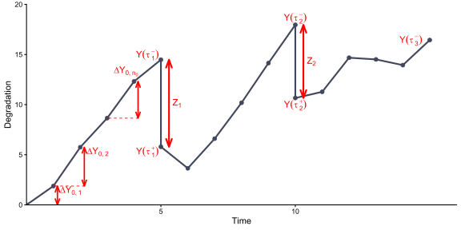
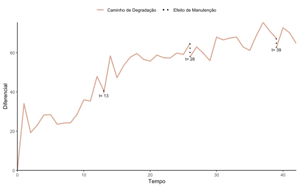
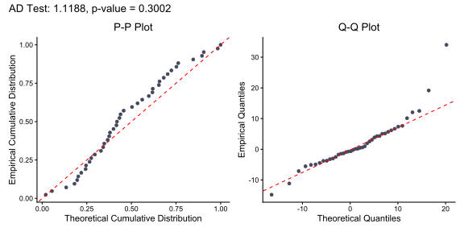
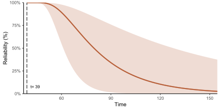
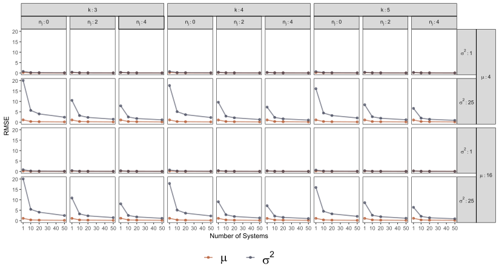

# WienerRS: Reliability Analysis of Repairable Systems under Imperfect Maintenance

<!-- badges: start -->
[](https://github.com/GeorgeSantos1/Wiener_RS)
[](https://www.gnu.org/licenses/gpl-3.0)
[](https://www.r-project.org/)
<!-- badges: end -->

**WienerRS** is an R package designed for statistical inference, degradation modeling, and reliability prognosis of repairable industrial systems subject to imperfect maintenance. 

The package implements an extended reliability modeling framework that couples a **Wiener degradation process with drift** with a dynamic **Arithmetic Reduction of Degradation with Memory One (ARD₁)** model under a **complete observation scheme**. It provides exact Maximum Likelihood Estimation (MLE), asymptotic inference, First Passage Time (FHT) / Remaining Useful Life (RUL) reliability predictions, model comparison criteria, and publication-ready diagnostic visualizations.

---

## Academic Context & Reference

This package accompanies the methodologies, simulation studies, and empirical applications presented in:

1. **Journal Article (Under Review):**  
   > Santos, G. A. A., Ferreira, P. H., Portela, A. C. T., Toledo, M. L., Morita, L. H. M., Tomazella, V., & Droguett, E. L.  
   > *Reliability Analysis of Repairable Systems Using the Arithmetic Reduction of Degradation with Memory One (ARD₁) Model: An Application to Industrial Bag Filter Data*.
   
2. **Master's Dissertation:**  
   > Santos, G. A. A. (2025).  
   > *Desenvolvimento de Metodologias Estatísticas para Modelagem da Degradação da Performance de Sistemas Reparáveis*.  
   > Dissertação de Mestrado, Programa de Pós-Graduação em Matemática (PGMAT), Instituto de Matemática e Estatística, Universidade Federal da Bahia (UFBA), Salvador, Bahia, Brasil.

---

## Key Features

- **Wiener Degradation Process:** Models non-monotonic stochastic deterioration with positive drift ($\mu > 0$) and diffusion variance ($\sigma^2 > 0$).
- **Dynamic ARD₁ Imperfect Maintenance:** Supports time-varying repair effectiveness ($\rho_j \in [0, 1]$), overcoming the limitation of constant-effect assumptions in classical maintenance models.
- **Multiple Systems Inference ($S \ge 1$):** Generalizes closed-form Maximum Likelihood Estimators (MLE) for single and multiple independent monitored units under complete observation.
- **RUL Prognosis via First Passage Time (FHT):** Exact derivation of the conditional survival function and PDF using the shifted Inverse Gaussian (IG) distribution.
- **Pointwise Asymptotic Confidence Intervals:** Standard errors and 80%/95% confidence bands computed via the Delta Method with log-log transformation.
- **Goodness-of-Fit Diagnostics:** Probability-Probability (P-P) and Quantile-Quantile (Q-Q) plots coupled with the Anderson-Darling (AD) test.
- **Model Selection & Hypothesis Testing:** Log-Likelihood, Akaike Information Criterion (AIC), Bayesian Information Criterion (BIC), and Likelihood Ratio Test (LRT) to compare time-varying vs. fixed maintenance models.
- **Packaged Industrial Dataset (`bagfilter`):** High-frequency differential pressure data (309,901 raw industrial records filtered and adjusted) from an operational industrial baghouse filter in a calcium carbonate drying plant.

---

## Mathematical Formulation

### 1. Underlying Degradation & ARD₁ Maintenance

The underlying natural degradation is modeled as a continuous Wiener process with drift:

$$
X(t) = X(0) + \mu t + \sigma B(t), \quad t \ge 0
$$

where $\mu > 0$ is the drift coefficient, $\sigma^2 > 0$ is the diffusion variance, and $B(t)$ is standard Brownian motion.

Under the dynamic ARD₁ model with maintenance interventions at times $\tau_1 < \tau_2 < \dots < \tau_k$, each maintenance action reduces the accumulated degradation since the previous intervention by a fraction $\rho_j \in [0, 1]$:

$$
Y(t) = X(t) - \sum_{j \le r} \rho_j [X(\tau_j) - X(\tau_{j-1})], \quad t \in [\tau_r, \tau_{r+1})
$$

The effective degradation reduction jump at time $\tau_j$ is given by:

$$
Z_j = Y(\tau_j^+) - Y(\tau_j^-) = -\rho_j [X(\tau_j) - X(\tau_{j-1})]
$$

Under the complete observation scheme (monitoring immediately before and after each intervention), the maintenance efficiencies $\rho_j$ are analytically obtained:

$$
\rho_j = \frac{-Z_j}{\sum_{i=1}^{n_{j-1}+1} \Delta Y_{j-1, i}}
$$

<p align="center">
  
  <br>
  <em>Figure: Degradation trajectory under complete observation with imperfect maintenance jumps and inspection increments.</em>
</p>

### 2. Maximum Likelihood Estimators (MLE)

For $S$ independent systems observed up to horizon $\tau$, the closed-form estimators are:

$$
\hat{\mu} = \frac{\sum_{l=1}^S \left[ y_l(\tau) - \sum_{j=1}^k z_{l,j} \right]}{S \cdot \tau}
$$

$$
\hat{\sigma}^2 = \frac{1}{S(N + k + 1)} \sum_{l=1}^S \sum_{j=0}^k \sum_{i=1}^{n_j+1} \frac{(\Delta y_{l,j,i} - \hat{\mu} \Delta t_{l,j,i})^2}{\Delta t_{l,j,i}}
$$

The unbiased Bessel-corrected estimator for diffusion variance is:

$$
s^2 = \frac{S(N + k + 1)}{S(N + k + 1) - 1} \hat{\sigma}^2
$$

### 3. Reliability Function & Remaining Useful Life (RUL)

Conditioned on the system state $Y(t_0)$ immediately following the most recent maintenance at time $t_0$, the First Passage Time (FHT) to a critical failure threshold $\alpha > Y(t_0)$ follows a shifted Inverse Gaussian distribution:

$$
T \sim \text{IG}\left(\frac{\alpha - Y(t_0)}{\mu}, \frac{[\alpha - Y(t_0)]^2}{\sigma^2}\right)
$$

The resulting reliability function $R(t)$ for $t \ge t_0$ is:

$$
R(t) = \Phi\left( \frac{\alpha - Y(t_0) - \mu(t - t_0)}{\sigma \sqrt{t - t_0}} \right) - \exp\left( \frac{2\mu[\alpha - Y(t_0)]}{\sigma^2} \right) \Phi\left( \frac{-\mu(t - t_0) - \alpha + Y(t_0)}{\sigma \sqrt{t - t_0}} \right)
$$

---

## Installation

You can install the development version of **WienerRS** directly from GitHub:

```r
# If not yet installed, install 'remotes'
install.packages("remotes")

# Install WienerRS
remotes::install_github("GeorgeSantos1/Wiener_RS")
```

---

## Quick Start Tutorial

### 1. Load the Package and Empirical Data

```r
library(WienerRS)

# Load the industrial bag filter dataset
data("bagfilter")

# Inspect structure
head(bagfilter)

# Visualize the degradation trajectory with maintenance interventions
p_maint <- plot_maintenance(
  data      = bagfilter,
  ylab      = "Differential [mmWC]",
  xlab      = "Time",
  show_time = TRUE
)
print(p_maint)
```

<p align="center">
  
  <br>
  <em>Figure: Observed degradation path of the industrial bag filter with imperfect maintenance actions at <i>t</i> = 13, 26, 39 (13-minute intervals).</em>
</p>

### 2. Parameter Estimation

Estimate the drift parameter $\mu$, diffusion variance $\sigma^2$, and individual repair efficiencies $\rho_j$:

```r
# Maximum Likelihood Estimates
mu_hat     <- mle_drift_maintenance(bagfilter)
sigma2_hat <- mle_sigma2_maintenance(bagfilter)
rho_hat    <- calc_rho(bagfilter)

cat("Drift (mu):", round(mu_hat, 4), "\n")
cat("Diffusion Variance (sigma^2):", round(sigma2_hat, 4), "\n")
cat("Maintenance Efficiencies (rho_j):", round(rho_hat, 4), "\n")
```

### 3. Goodness-of-Fit Diagnostic (P-P and Q-Q Plots)

Verify whether the Wiener degradation increments conform to the Gaussian distribution assumption:

```r
p_diag <- plot_diagnostic_qq(bagfilter)
print(p_diag)
```

<p align="center">
  
  <br>
  <em>Figure: Goodness-of-fit diagnostics (P-P plot and Q-Q plot) for degradation increments under the Wiener process, supported by the Anderson-Darling test (AD = 0.8792, <i>p</i>-value = 0.4266).</em>
</p>

### 4. Reliability Prediction with Confidence Bands

Evaluate the survival probability starting after the 3rd maintenance intervention ($t_0 = 39$, $x_0 = 62.52$ mmWC) up to critical failure threshold $\alpha = 150$ mmWC:

```r
# Approximate asymptotic variances for Delta Method
df_deg  <- 38 + 3 + 1 - 1
var_mu  <- (sqrt(sigma2_hat) / sqrt(42))^2
var_sig <- (sqrt((sigma2_hat^2) * 2 / df_deg))^2

# Reliability curve with pointwise 80% confidence interval
rel_res <- plot_reliability_ci(
  drift      = mu_hat,
  sigma2     = sigma2_hat,
  var_drift  = var_mu,
  var_sigma2 = var_sig,
  threshold  = 150,
  t0         = 39,
  x0         = min(bagfilter$Y[bagfilter$Time == 39]),
  t_max      = 155,
  x_label    = "Time",
  y_label    = "Reliability (%)",
  palette    = "taylor1989"
)

# Plot reliability curve
print(rel_res$plot)

# View computed reliability table
head(rel_res$data)
```

<p align="center">
  
  <br>
  <em>Figure: Predicted reliability function <i>R</i>(<i>t</i>) following the 3rd maintenance intervention (<i>t</i><sub>0</sub> = 39) with 80% pointwise asymptotic confidence interval bands (log-log Delta method).</em>
</p>

### 5. Model Comparison (Complete vs. Fixed Maintenance)

Compare the time-varying ARD₁ model against a baseline fixed-effect model (LRT, AIC, and BIC):

```r
# Execute complete analysis script
source("scripts/case_study_analysis.R")
```

---

## Monte Carlo Simulation Study

A comprehensive factorial simulation experiment ($M = 1000$ replications per scenario) assesses the finite-sample performance, unbiasedness, and consistency of the Maximum Likelihood Estimators across varying numbers of systems ($S \in \{1, 10, 20, 50\}$), maintenance interventions ($k \in \{3, 4, 5\}$), and intermediate inspection measurements ($n_j \in \{0, 2, 4\}$):

<p align="center">
  
  <br>
  <em>Figure: Root Mean Square Error (RMSE) for parameter estimators (&mu; and &sigma;<sup>2</sup>), demonstrating rapid convergence to zero as sample size and inspection frequency increase.</em>
</p>

---

## Repository Structure

```text
Wiener_RS/
├── R/                     # Exported functions and package documentation
├── data/                  # Built-in packaged dataset ('bagfilter.rda')
├── data-raw/              # Raw industrial dataset ('Bagfilter_Dataset.xlsx') & extraction script
├── figures/               # All 17 article & dissertation figures (SVG, PDF, EPS)
├── man/                   # Rd documentation files for all package functions
├── scripts/               # Standalone, fully reproducible analysis & execution scripts
│   ├── case_study_analysis.R    # Real-world bag filter case study & model comparison
│   ├── generate_figures.R       # Generates and exports all 17 article figures
│   ├── run_simulation_study.R   # Monte Carlo factorial simulation routines
│   └── run_tests.R              # Standalone unit test suite runner
├── simulations/           # Monte Carlo pre-computed results (SimDesign4.rds) & README
├── tests/                 # Formal testthat test suite (76 comprehensive tests)
├── DESCRIPTION            # R package metadata and dependency configuration
├── NAMESPACE              # Exported namespace directives
└── README.md              # Project documentation
```

---

## Reproducibility

All empirical results, simulation tables, and publication figures can be reproduced directly using the scripts in `scripts/`:

1. **Case Study & Statistical Inference:**
   ```bash
   Rscript scripts/case_study_analysis.R
   ```
2. **Export All Paper Figures (SVG, PDF, EPS):**
   ```bash
   Rscript scripts/generate_figures.R
   ```
3. **Simulation Study Evaluation:**
   ```bash
   Rscript scripts/run_simulation_study.R
   ```
4. **Unit Test Verification:**
   ```bash
   Rscript scripts/run_tests.R
   ```
---

## Authors

- **George Anderson Alves dos Santos** (Author, Maintainer)  
  *Federal University of Bahia (UFBA)* — [g.anderson.stat@gmail.com](mailto:g.anderson.stat@gmail.com)
- **Paulo Henrique Ferreira da Silva** (Advisor, Co-author)  
  *Federal University of Bahia (UFBA)*
- **Adriane Caroline Teixeira Portela** (Co-author)  
  *University of São Paulo (ICMC-USP)*
- **Maria Luíza Toledo** (Co-author)  
  *National School of Statistical Sciences (ENCE-IBGE)*
- **Lia Hanna Martins Morita** (Co-author)  
  *Federal University of Mato Grosso (UFMT)*
- **Vera Lúcia Damasceno Tomazella** (Co-author)  
  *Federal University of São Carlos (UFSCar)*
- **Enrique López Droguett** (Co-author)  
  *University of California, Los Angeles (UCLA)*

---

## Citation

If you use **WienerRS** or the associated methodology in your research, please cite:

```bibtex
@article{santos2026reliability,
  title={Reliability Analysis of Repairable Systems Using the Arithmetic Reduction of Degradation with Memory One ($\text{ARD}_1$) Model: An Application to Industrial Bag Filter Data},
  author={Santos, George Anderson Alves dos and Ferreira, Paulo Henrique and Portela, Adriane Caroline Teixeira and Toledo, Maria Lu{\'\i}za and Morita, Lia Hanna Martins and Tomazella, Vera and Droguett, Enrique Lopez},
  journal={Journal Title (Under Review)},
  year={2026}
}

@mastersthesis{santos2025desenvolvimento,
  title={Desenvolvimento de Metodologias Estat{\'\i}sticas para Modelagem da Degrada{\c{c}}{\~a}o da Performance de Sistemas Repar{\'a}veis},
  author={Santos, George Anderson Alves dos},
  school={Universidade Federal da Bahia (UFBA)},
  year={2025},
  address={Salvador, Bahia, Brasil}
}
```

---

## License

This package is licensed under the [GNU General Public License v3.0 (GPL-3)](https://www.gnu.org/licenses/gpl-3.0.html).
